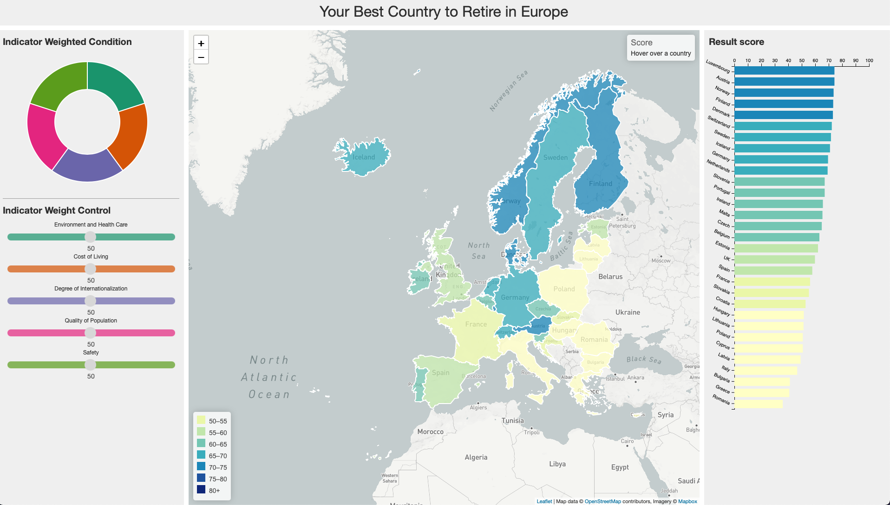

<h1 align="center">Your Best Country to Live After Retiring in Europe</h1>

<p align="center">
    
</p>

<p align="center">
    <i>
        <b>
        Group Members: <br>
        Chaoran Li, Chih-Chieh Lin, Haochen Wang, Linxiao Zhu, Xiang Li 
        </b>
    </i>
</p>

## Short Description
Retirement occupies an important place in everyone's life plan. Living in another country after retirement is becoming more attractive than ever. Our work aims to develop a visual application to help users choose the most suitable country for them among 31 European countries. We develop a multiview interface with Flask based web service, and add interactivity to it. After the users input their personal preferences on five indicators, our system can calculate the corresponding recommendation results and rankings, and visually present them on the web for easy comparison.

## Information Visualization Overview
<p align="center">
    
    <span style>Initial Look</span>
</p>

## Usage
__Pre-requirements:__ Python3.7

* Start Virtual Environment
    ```
    source venv/bin/activate
    ```
* Run the program
    ```
    bash run.sh
    ```
* Open the browser and run http://127.0.0.1:5000/

## Interactive Functions
- Indicator Weight Control (Slider): 
User can allocate the different weights of indicators by sliding the corresponding sliders. 

- Indicator Weighted Condition (Donut plot): 
According to the indicator weights chose from user, we also offers a donut plot in order to make user easier figure out the percentage condition of each indicator.

- Choropleth map (center part)
    - It will show the country’s score and highlight the area when the mouse is hover over such country.
    - It also presents the score by color-hue gradient in real time (whenever user slide the sliders).

- Bar plot  (right part)
    - It would change(sort) in real time when the user slide the sliders.
    - It popups a window showing the country’s rank, name, and score; and also highlight the bar when the mouse hover over such rectangle. Moreover, in the meantime, it would also highlight the corresponding country’s area in the map

## Key words
Information visualization, Geospatial analysis, Retirement, Europe, D3.js


